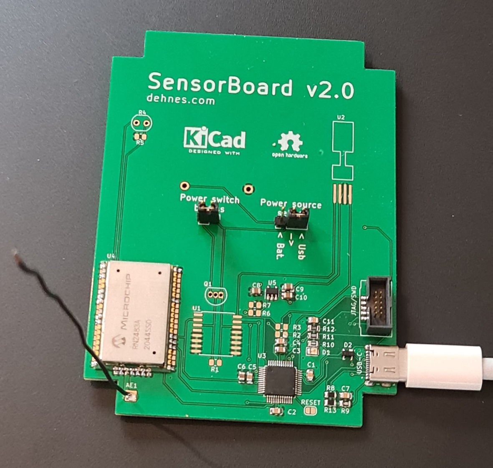

# LoRa bridge
Firmware for a modified version of my [LoRa SensorBoard](https://github.com/sebdehne/SensorBoard-Firmware) which
I use as a LoRa-to-PC bridge. It connects directly to a PC using USB Type-C.

The LED, which blinks at a fixed rate if there is some data been transmitted or received, is handled in a non-blocking way such that it does not influence the data throughput.

Even though this is no official Arduino board, I am using the bootloader from [Arduino Nano 33 IoT](https://store.arduino.cc/arduino-nano-33-iot) because of Arduino's excelent toolchain support.
